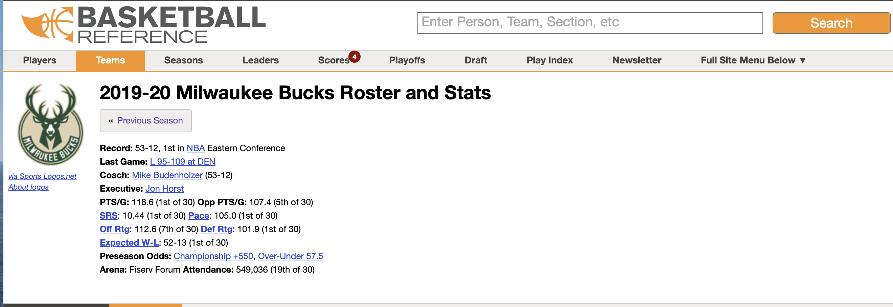
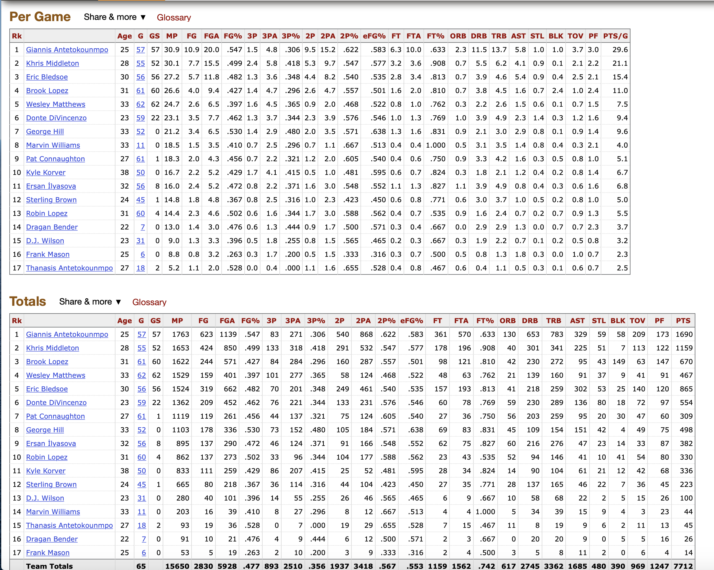
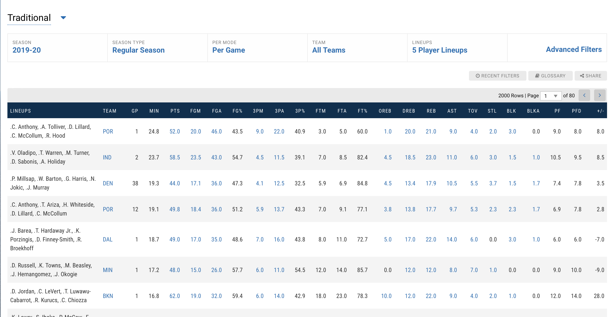
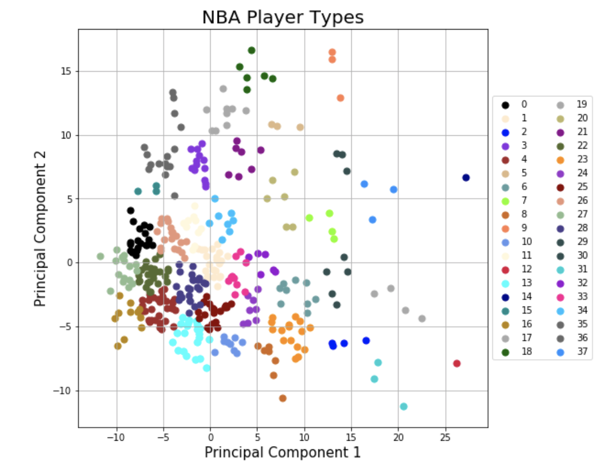
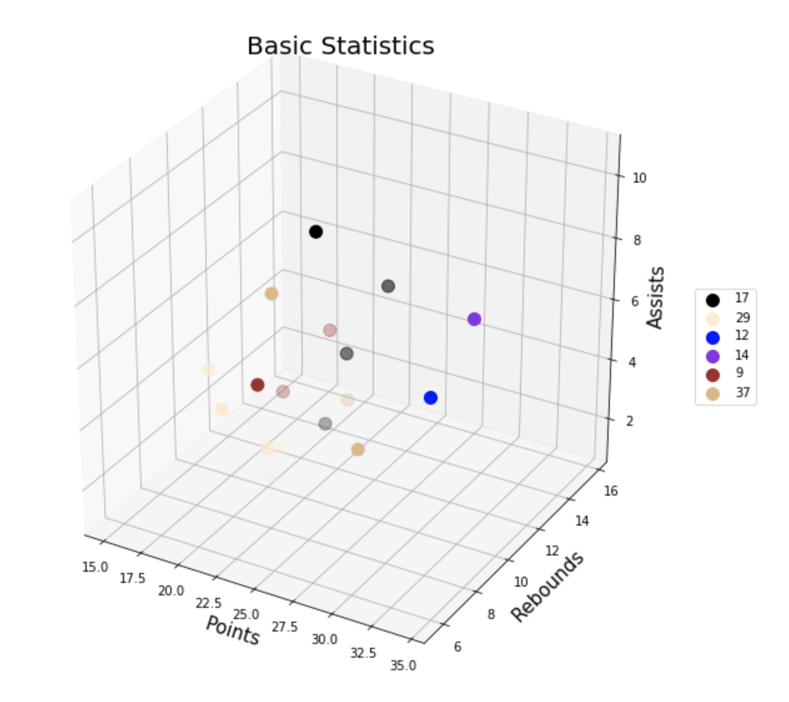
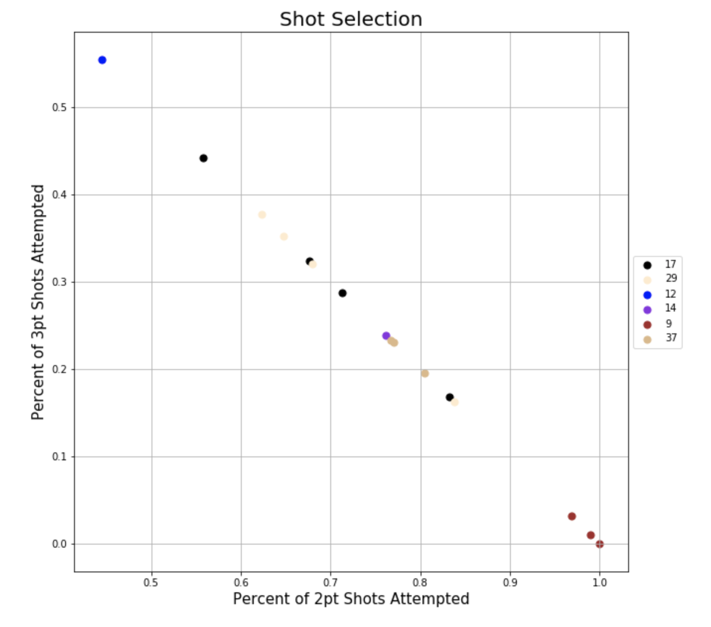
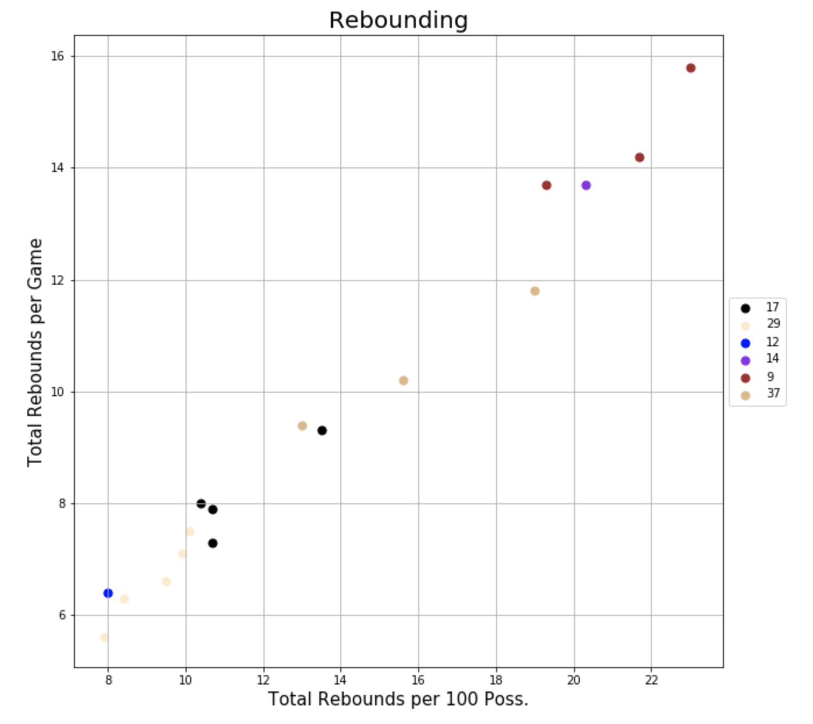

# Predicting Ideal NBA First Unit for 2019-20 Season

## Abstract

This project functions to aid the understanding of roster success in the NBA game for NBA Front Offices as well as the average fan.

The goal of my final project with Flatiron School was to combine various forms of supervised and unsupervised learning to find insight in roster composition of NBA teams. My constant drive to improve both my IQ of the sport through coaching youth coming from different demographics, and my understanding of the enterprise of the sport at the professional level led me to find a marriage between the two that would be interesting for NBA enthusiasts and the casual fan.

This project aims to find the best combination of players for a five man lineup by first defining player types that exist in the current NBA, then predicting performance of all combinations of those types, given some restrictions.

The overall plan was very straightforward, but the interpretation of my results is what took the most time:  
1. Scrape data from relevant sources (Basketball Reference.Com, NBAStats.Com)  
2. Clean individual player data  
3. Find the best clustering algorithm for the dataset  
4. Define player types  
5. Clean lineups data  
6. Find the best regression model to predict performance  
7. Create test dataset for possible combinations of player types  
8. Predict performance of test dataset and find the best  

I use a combination of BeutifulSoup and selenium to scrape my data. I then use a gridsearch and pipeline to test over several combinations of parameters looking for the best clustering algorithm for defining my player types using the data I have available to me. I test over KMeans, MiniBatchKMeans, GaussianMixture and Birch and found that a combination of StandardScaler, PCA, and Gaussian Mixture would yield the best combination of silhouette score and c-h criterion to give me 38 clusters. Using these clusters, and restricting combined salary of players, combined height/ball-handling experience (I can more into that in my notebook), I was able to find 200,000 possible combinations of player types for five-man lineups. I use available lineup data from the NBA to create an OLS linear regression model to predict net rating and find the best and worst lineups accoridng to predicted net rating.

All best lineups included three player types every time: 1. Two-way double double producing, rebounding beast, 2. Team leading, long range three point sniping, primary ball handling guard, and 3. Young, athletic, two-way, glass-cleaning rim runner. The players around them include various ball handlers and inside or outside primary and secondary scorers. The NBA has been valuing the three point shot and the layup as the two best shots to take for a while now, because they either are the most point producing shot, or the most efficient.

All worst lineups included: 1. Hussle player, provides energy, average to below average role player, 2. Third string big man, 3. Third string guard and 4. Veteran third string forward. These are all low minute players who have low rank in production (according to me). It makes sense that a combination of guys who rarely play, meaning they don't have opportunity to have a big impact, would be the worst lineups. This is a downfall of my process, and basketball in general, if one isn't given an opportunity, we may not see what potential they do have.

Overall I would recommend teams to focus more on securing players that like to push the pace, as we've seen with our big men in our best lineups, but not to stress to much on outside shooting. I would rather have a player that excels in what they are good at than try to be better at something they are bad at. If you are a big man that is interior beast, or that runs the floor 200% of the time, do that the whole game, and don't focus on workign in the perimeter, because your teammates will pick up the pieces (like our elite scoring guard).

## Overall Goal

This goal of this project is to group NBA players based on their production on the court and find the best performing five-man linuep in the current NBA season.

## Methodology

### 1. Scraping and Cleaning Available Data

### 2. Clustering NBA Players to Define Player Types

### 3. Predicting Best Five-Man Combination of Player Types

## Scraping and Cleaning Available Data

Basketball Reference Team Page Example 1:

Basketball Reference Team Page Example 2:

NBA Stats Team Page Example:

Using BeutifulSoup and selenium, I scraped my data from both sites shown above.

## Clustering NBA Players to Define Player Types

